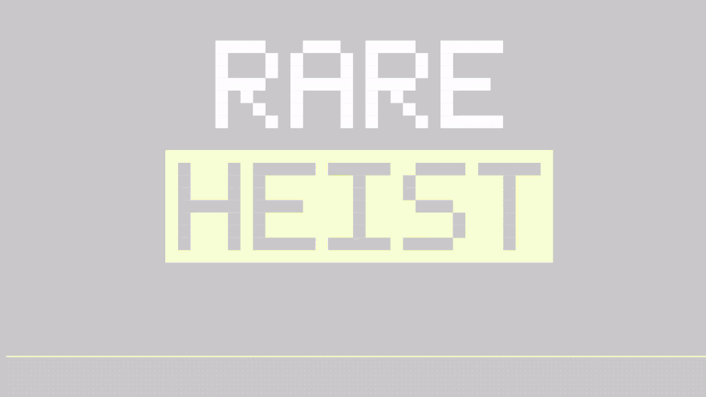
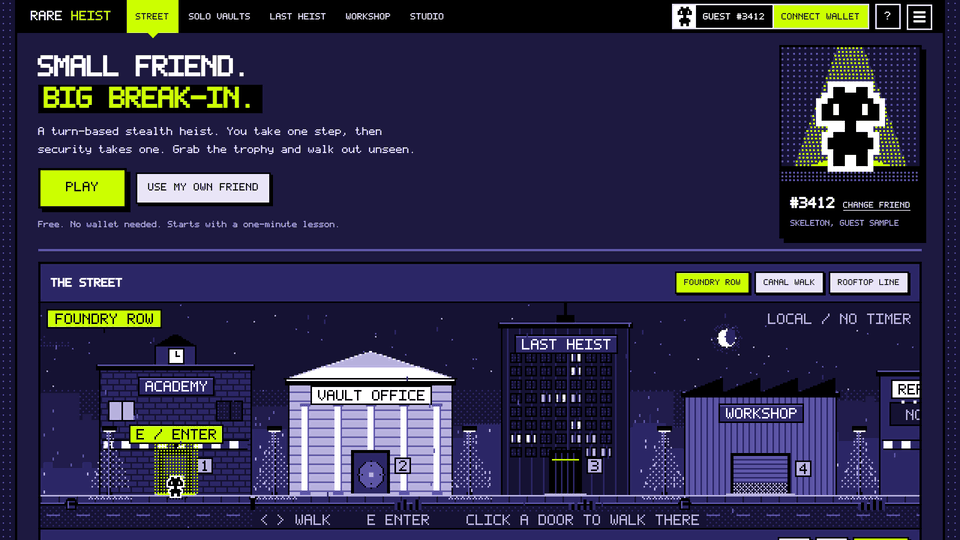
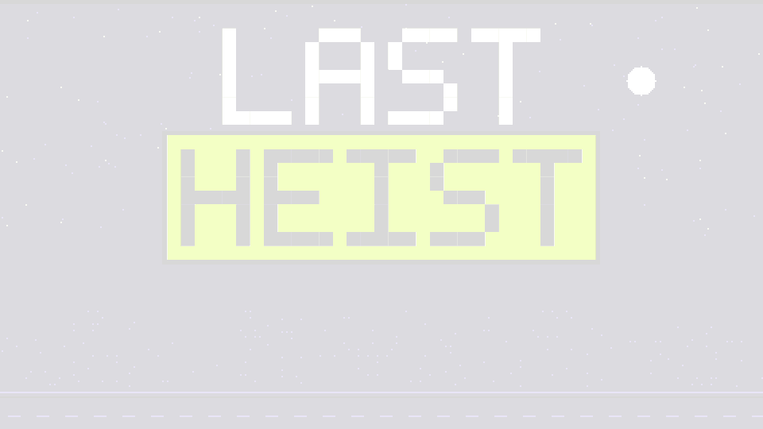
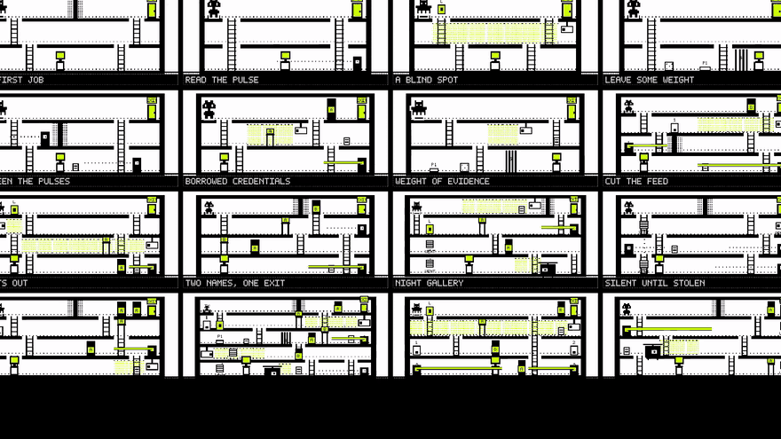
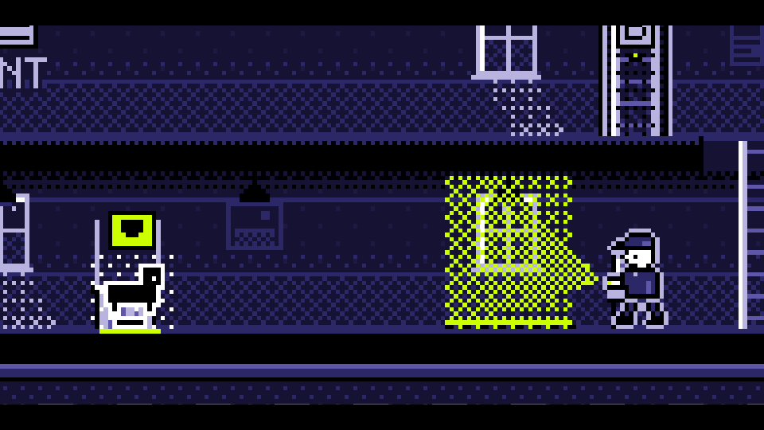
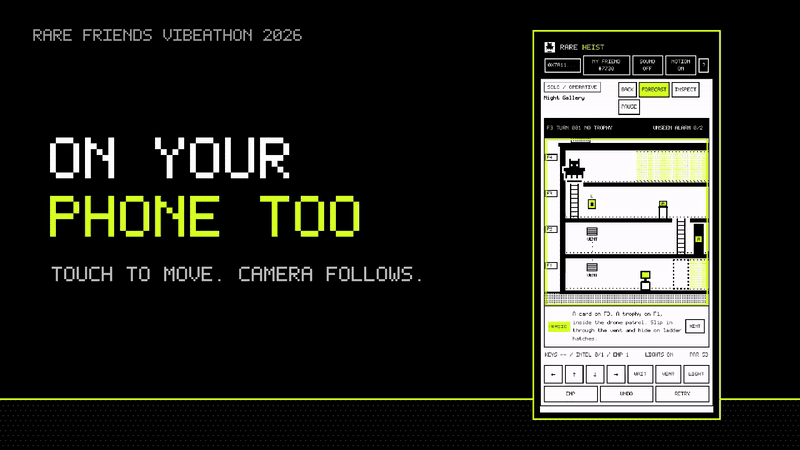

<div align="center">



# RARE HEIST

**Sneak your own Rare Friend through a cutaway building, one move at a time.<br>Then leave the next thief a harder way in.**

[**▶ PLAY IN YOUR BROWSER**](https://rareheist-bc89faa0.sslip.io/) &nbsp;·&nbsp; [mirror](https://warninghejo-blip.github.io/rare-heist/) &nbsp;·&nbsp; [**WATCH THE TRAILER**](media/rare-heist-trailer-720p.mp4) &nbsp;·&nbsp; [1080p](media/rare-heist-trailer.mp4)

Rare Friends Vibeathon 2026 · Character Spotlight · Token Activity · free, no install, no wallet needed to try

</div>

---

## The pitch

Every building has a way in. You move one cell, then security moves. Click where you want to go and your Friend walks there, stopping the moment the next step would be seen. Cameras, lasers, patrol drones and guards on foot all run on a readable clock, so a perfect heist is always possible. You just have to see it. One detection ends the job.

The thief is **your** Rare Friend: its original 16×16 frames, read from Robinhood Chain. And in **Last Heist**, the vault itself is written by the players.

<table>
<tr>
<td width="50%"></td>
<td width="50%"></td>
</tr>
<tr>
<td><b>Play as the Friend you own.</b><br>Connect a wallet and the game finds your hardwired Generations Friends. It reads each one's own walking frames from the chain and puts that exact character in every building. Connecting only reads: no signature, no transaction.</td>
<td><b>Last Heist: one vault, every clear changes it.</b><br>Clear the shared vault, then drag one wall, laser or camera from the side palette onto it. A built-in solver checks on the spot that your piece breaks the last winning route and that the vault can still be beaten; then you prove it by clearing your version yourself. The server re-runs every route. The last thief standing when the clock runs out takes the prize.</td>
</tr>
<tr>
<td></td>
<td></td>
</tr>
<tr>
<td><b>22 handmade heists.</b><br>Five lessons, a 14-job campaign and a 3-job Black Archive. Guards on foot with flashlights, keycards, pressure plates, circuits, blackouts, vents, lockdowns and drones you hide from in a ladder hatch. Every level ships with a clean solution found by an automated solver: press WATCH SOLUTION in any job, or open the full list at the bottom of SOLO VAULTS.</td>
<td><b>Read the clock or get caught.</b><br>INSPECT shows any device's next beats without spending a turn. Guards see three cells ahead, one in the dark, and EMP does not stop them; cut the lights or wait in a hatch. The optional INTEL folder is the security plans: take it and every patrol route, with its turn points, and every camera sweep stays drawn on the building for the rest of the job. Get it wrong and the field report shows exactly what saw you, and when.</td>
</tr>
</table>

<div align="center"><br><b>Works on your phone.</b> Touch controls, and the camera follows your Friend.</div>

---

## Your Friend, exactly as it is

- **The original sprite.** The thief is drawn from the Friend's original 1-bit frames: idle and walk in four directions, never redrawn, never recoloured.
- **The FriendSDK reference look.** Integer scale up to 5×, a black mask and a white one-pixel halo.
- **How your Friends are found.** **CONNECT WALLET** works with any EIP-6963 wallet and switches it to Robinhood Chain (4663). Discovery mirrors FriendSDK's `readOwnedFriends`: `balanceOf`, then the owner-filtered `Transfer` history, then a fresh `ownerOf` and `generation` check.
- **Where the frames come from.** The registry: `familyOf`, then `seedOf`, then `frames(family, seed)`.
- **No wallet? Three ways in:**
  - **PREVIEW** any Friend by token ID.
  - Paste a holder's address to see their Friends (read-only).
  - Play as a guest with the official FriendSDK samples #3412 Skeleton and #7730 Hoverer.
- **The Friend is the star.** Picking a Friend opens a reveal with its own walking frames, #ID, family and generation. The home portrait faces you and breathes on its own idle frames (still with MOTION OFF). Results stage it at the open exit or under a searchlight. Last Heist, the Hall of Ash and My Runs show every player as its Friend: #ID and sprite, and a Last Heist player who never set a name appears as "Friend #ID".
- **Replays show each player's own Friend.**

## Economy: real RF, burned

| | |
|---|---|
| **LIVE BURN (beta), real RF** | Opt-in, in the Studio. Burn real $RAREFRIENDS from your own wallet to unlock cosmetics. **100% goes to `0x…dEaD`. Nobody is paid**: no creator, developer or prize share. One plain RF `transfer`, checked from the receipt, with no approvals and no custody. |
| **Hall of Ash** | Every Rare Heist burn carries a tag naming the item and the Friend, so the leaderboard and your unlocks are rebuilt from the chain alone. No server. |
| **Real RF balances** | Your wallet, your Friend's token-bound wallet and `0x…dEaD`, read live. |
| **Last Heist pool** | Simulated. The sponsor pool starts at 20,000 DEMO RF, 1,000 is reserved per round, and the winner is paid once. Invariant: initial = available + reserved + paid. |
| **DEMO Studio** | The default. Themes and a level pack for DEMO RF, with a proposed 70% creator / 20% burn / 10% developer split. |

**RF costs (LIVE BURN):**

| Item | Cost | What it does |
|---|---|---|
| Golden Trail | 25 RF | lime footprints behind your Friend (LIVE only) |
| Hatchwork | 10 RF | interface theme |
| Signal Paper | 10 RF | interface theme |
| The Black Archive | 50 RF | three extra heists |
| Tribute | any amount | a place in the Hall of Ash |

All burned. No randomness, no consumables, no gameplay advantage, no payouts. DEMO stays the default on every load, as the Vibeathon rules ask, and everything a player needs is free.

- Rules and the on-chain design for seasons, one-Friend-one-entrant and signed settlement: **[docs/ECONOMY.md](docs/ECONOMY.md)**.
- A first real burn, step by step: **[docs/LIVE-BURN.md](docs/LIVE-BURN.md)**.

## Controls

| Key | Action | Key | Action |
|---|---|---|---|
| **Click any cell** | walk there; stops before a step that would be seen | Space | wait a turn |
| ← → / A D | walk | | |
| ↑ ↓ / W S | climb | E | vent |
| I | inspect a device (free) | L | light switch |
| Q | EMP: sensors off for 4 turns | Z / R | rewind (practice) / retry |

Touch: tap any cell to walk there, or use the on-screen buttons. Hovering with a mouse previews the route. SOUND and MOTION sit in the settings menu (top right); `?` opens How to play.

## Run it yourself

```sh
node --version          # 22.16+
node build.mjs          # builds index.html from src/
npm start               # shared Last Heist server on http://127.0.0.1:4173
```

`node sdk/src/friend-landing.mjs` regenerates `friend-edition/index.html`, the landing page in front of the static FriendSDK build in `friend-edition/app/`.

Open `index.html` directly to play solo without a server. The GitHub Pages mirror is static, so shared Last Heist rounds live on the main link, which runs `server/app.mjs` behind nginx (`HOST=127.0.0.1`, `PUBLIC_ORIGIN=https://…`, `DATA_DIR` for the SQLite file). `render.yaml` is included for a one-click Render deploy.

## Checks

| Command | What it proves |
|---|---|
| `npm test` | All 23 levels are valid engine maps, follow the cutaway rules and have a clean route without EMP. Also covers LIVE BURN encoding and receipt-forgery checks, plus a shared-mode HTTP test against the real Node/SQLite server |
| `node --test tests/solver.test.cjs tests/solutions.test.cjs` | The in-game solver matches the reference solver on every level and proves an unbeatable vault unbeatable; every stored solution still wins with the current engine |
| `node tests/editor-browser.mjs` | The Last Heist obstacle editor against the real server: drag and tap placement, a sealing wall is proven unbeatable and cannot be proved, a harmless one is, then proved and published |
| `node tests/campaign-browser.mjs` | Every campaign job is won through the real UI with the keyboard |
| `node tests/travel-browser.mjs` | Click-to-travel walks real turns and stops before any step that would be seen |
| `node tests/wallet-browser.mjs` | The whole wallet flow against a mock EIP-6963 wallet that answers like the Generations, registry and RF contracts, including LIVE BURN: confirm, burn, receipt check, unlock, Hall of Ash, rejection and not enough RF |
| `node tests/burn-pending-browser.mjs`, `burn-inflight-browser.mjs`, `burn-unknown-browser.mjs`, `burn-restore-tribute-browser.mjs` | One burn at a time: no second transaction while a burn is pending or its outcome is unknown (wallet timeout, reload, another tab); unlocks survive restore; Tribute from 1 RF |
| `cd sdk && npx friendsdk check games/rare-heist && npx friendsdk test games/rare-heist` | The FriendSDK Friend Edition is valid and passes the SDK's own browser fixture at 960 and 360 px |

The trailer is made by the game itself: `trailer/` renders every scene with the real engine and renderer, and the score in `trailer/music.py` is synthesised from scratch.

## Honest limits

- LIVE BURN is tested against a mock wallet and reviewed independently; Friend discovery was checked read-only against a real holder wallet on mainnet. Safari and physical phones were not tested by hand. LIVE BURN stays marked BETA.
- The server labels attempts with a Friend ID but does not verify ownership, and guest sessions are not unique people. No real-value prize should depend on the guest version.
- Difficulty is tuned with a solver. It has not been playtested with players.

## Credits

- Rare Friends character artwork: canonical Generations frames from **FriendSDK v0.1.2** (commit `762d6f5`), used under its [NOTICE](licenses/NOTICE.md).
- Code, levels, scenery, trailer and music: original to this project. Code is under the [MIT license](LICENSE).
- Independent Vibeathon entry. Not an official Rare Friends release.
